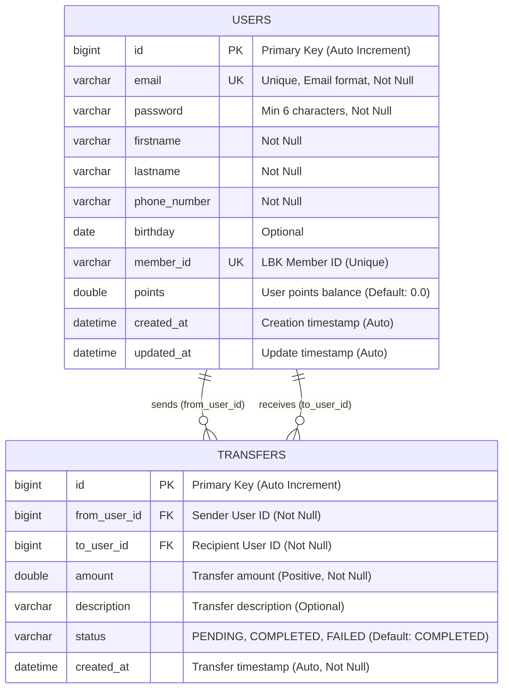

# Database ER Diagram

This document contains the Entity Relationship Diagram for the LBK Transfer Points API database schema.

## Entity Relationship Diagram

## Database Schema Details

### Users Table
- **Primary Key**: `id` (Auto-incrementing BIGINT)
- **Unique Constraints**: 
  - `email` - User's email address (also serves as login username)
  - `member_id` - LBK member identification number (format: LBK + 6 digits)
- **Validation Rules**:
  - Email must be valid format
  - Password minimum 6 characters (encrypted with BCrypt)
  - First name, last name, and phone number are required
  - Points default to 0.0 for new users
- **Timestamps**: Automatically managed creation and update timestamps

### Transfers Table
- **Primary Key**: `id` (Auto-incrementing BIGINT)
- **Foreign Keys**: 
  - `from_user_id` → `users.id` (Transfer sender)
  - `to_user_id` → `users.id` (Transfer recipient)
- **Validation Rules**:
  - Amount must be positive
  - Status enum: PENDING, COMPLETED, FAILED
  - Creation timestamp is immutable
- **Business Rules**:
  - Users cannot transfer to themselves
  - Sender must have sufficient balance
  - Each transfer creates an immutable record

## Relationships

1. **User ↔ Transfer (Sender)**
   - One user can send many transfers
   - Each transfer has exactly one sender
   - Relationship: `users.id` ← `transfers.from_user_id`

2. **User ↔ Transfer (Recipient)**
   - One user can receive many transfers
   - Each transfer has exactly one recipient  
   - Relationship: `users.id` ← `transfers.to_user_id`

## API Endpoints Coverage

### Authentication & User Management
- `POST /api/auth/register` - Creates new user with auto-generated member_id
- `POST /api/auth/login` - Authenticates using email/password
- `GET /api/auth/me` - Returns user profile including points balance
- `POST /api/auth/add-points` - Admin function to add points to user account

### Transfer Operations
- `POST /api/transfer` - Creates new transfer between users
- `GET /api/transfer/history` - Returns paginated transfer history for user
- `GET /api/transfer/contacts` - Returns recent transfer contacts
- `GET /api/transfer/search` - Finds user by member_id for transfers

## Security Considerations
- All passwords are encrypted using BCrypt
- JWT tokens used for API authentication
- Transfer operations require authenticated user
- Member ID generation ensures uniqueness
- Transfer amounts validated for positive values and sufficient balance
